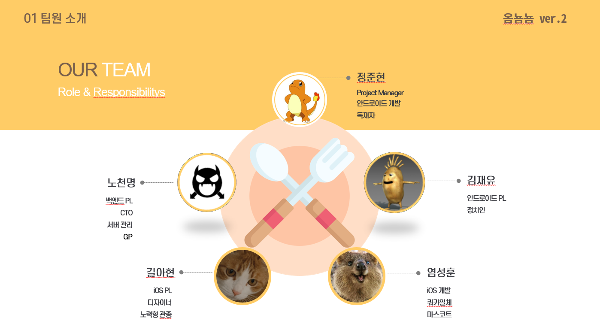
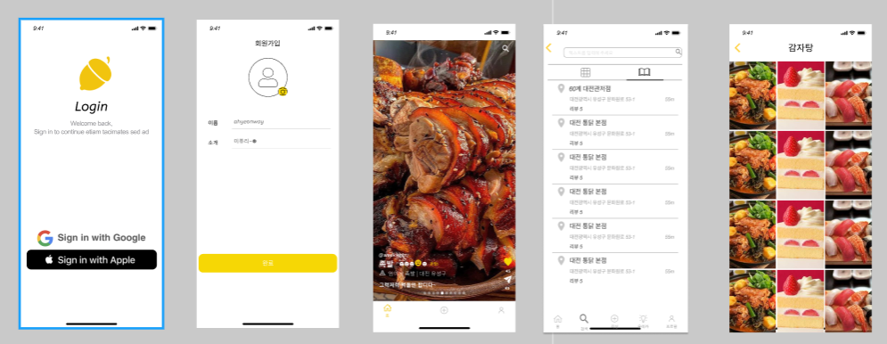
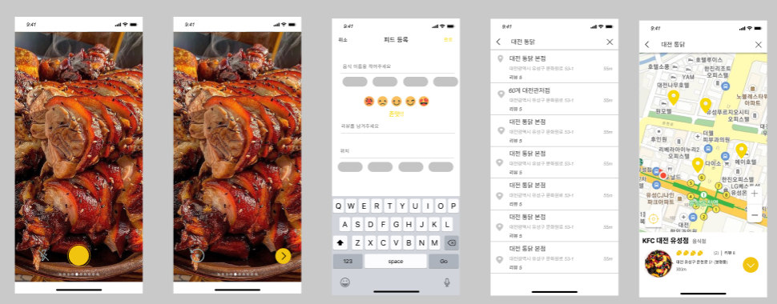
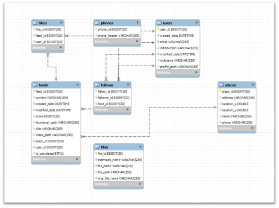
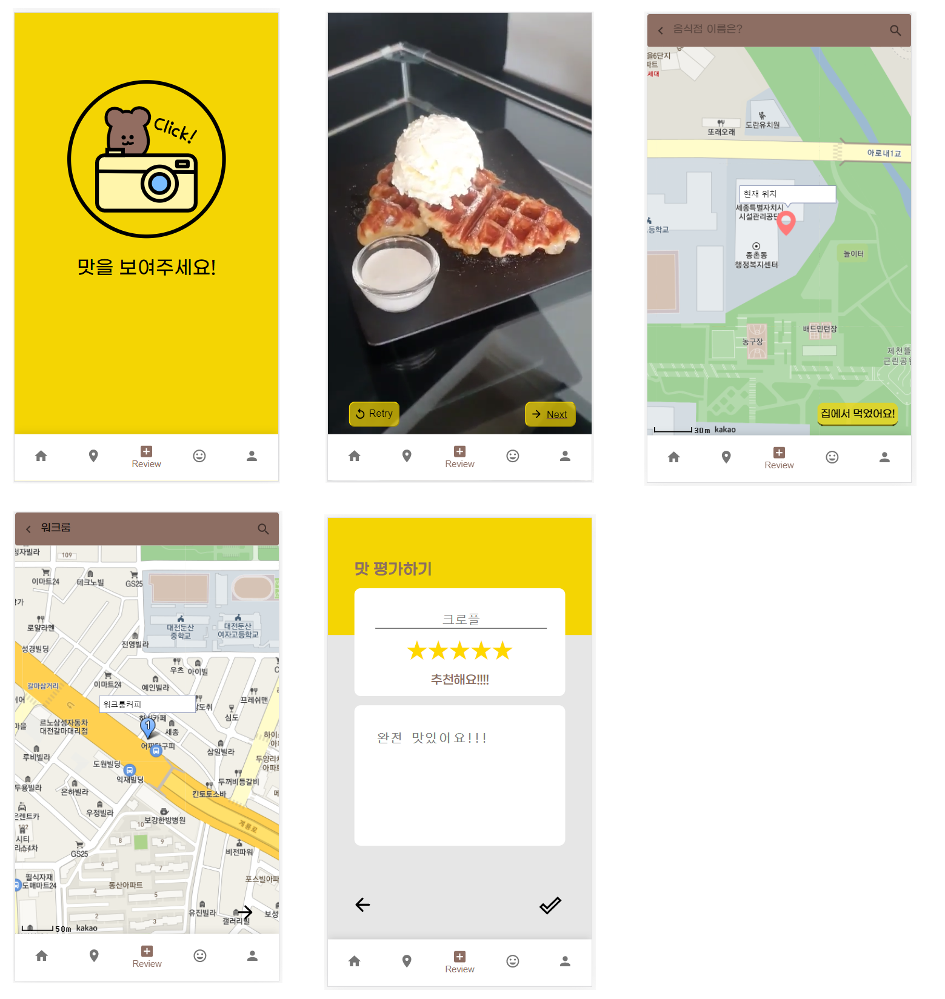
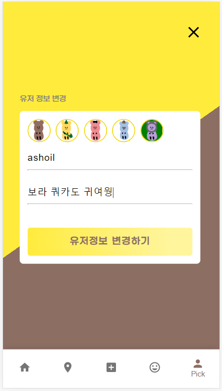

# 👨‍👩‍👦팀원 소개 (R&R)



###  정준현

 - PM(Project Manager)
    - 프론트엔드와 백엔드를 포함하는 프로젝트 전체를 리드
    - 프로젝트에 대한 모든 책임
 - 안드로이드 개발자
    - 안드로이드 파트 구현
    - 안드로이드 코드 취합

###  김재유

- 안드로이드 PL(Proejct Leader)
  - 안드로이드 파트를 리드하고 백엔드와의 협업을 위한 소통을 담당
  - 안드로이드 파트의 업무 조율

- 안드로이드 개발자
  - 프론트엔드 파트 구현
  - UI/UX 고안 후 구현.

###  길아현

- iOSPL(Proejct Leader)
  - iOS 파트를 리드하고 백엔드와의 협업을 위한 소통을 담당
  - iOS 파트의 업무 조율

- iOS 개발자
  - iOS파트 구현
  - UI/UX 고안 후 구현
- [README](./doc/AHYEON.md) 

###  염성훈

- iOS 개발자
  - iOS파트 구현
  - 외부 API(카카오지도)
  - UI/UX 고안 후 구현
- 마스코트
  - YUM? YUM! 쿼카 이미지 모티브 제공

###  노천명

- 백엔드 PL(Proejct Leader)
  - 백엔드 파트를 리드하고 프론트엔드와의 협업을 위한 소통을 담당
  - 백엔드 파트의 업무 조율

- CTO (Chief Technology Officer)
  - API, 외부 라이브러리 도입 등을 결정
  - 새롭게 도입된 정보와 지식을 다른 팀원들에게 전파

# ✨ 프로젝트 개요

| **시작일** | **종료일** | **내용**                 | **담당자**     |
| ---------- | ---------- | ------------------------ | -------------- |
| 20.04.12   | 20.04.12   | 기능 목록 상세 도출      | 정준현, 염성훈 |
| 20.04.13   | 20.04.14   | 피그마 디자인 구현       | 길아현, 정준현 |
| 20.04.15   | 20.04.16   | 개발 환경 구성           | 노천명         |
| 20.04.15   | 20.04.16   | AOS 개발 환경 구성       | 정준현, 김재유 |
| 20.04.15   | 20.04.16   | iOS 개발 환경 구성       | 길아현, 염성훈 |
| 20.04.19   | 20.04.23   | 개발: 백엔드 / DB 스키마 | 노천명         |
| 20.04.19   | 20.04.23   | 개발: 로그인 화면 개발   | 정준현, 염성훈 |
| 20.04.19   | 20.04.23   | 개발: 피드 화면 개발     | 김재유, 길아현 |
| 20.04.26   | 20.04.28   | 개발: 카메라 기능        | 김재유, 길아현 |
| 20.04.29   | 20.04.30   | 완성 기능 리뷰           | 김재유, 염성훈 |
| 20.05.03   | 20.05.07   | 개선 사항 추가 개발      | 팀 전원        |
| 20.05.10   | 20.05.14   | 통합 테스트              | 팀 전원        |
| 20.05.17   | 20.05.21   | 발표자료 준비            | 정준현, 염성훈 |
| 20.05.21   | 20.05.21   | 사이트 런칭              | 팀 전원        |


# **🧑‍🤝‍🧑협업규칙**

### 상시 약속

-  1일 1커밋, 1주 1MR(Merge Request) 1인 프로젝트라도 master 브랜치에서 작업하지 말자(연습)
-  Jira 이슈 관리
   -  스토리 포인트도 적극적으로 활용
-  공부한 내용이나 막힌 이슈를 README.md로 정리!!!
-  상대방에게 영향을 끼칠 코드 변경 사항이 있을 경우 **바로 바로** 보고
   -  새로운 기능 구현
   -  URL
   -  주고 받는 데이터 형식
   -  상대방이 구현하기로 정한 파일에서 코드 변경이 필요할 경우


### 하루를 시작하며

1. 지라를 통해 어제 한 일, 오늘 할 일 반영.
2. 어제 한 일 중에 상대방에게 영향을 끼칠 코드 변경 사항이 있을 경우 보고
   - URL
   - 주고 받는 데이터 형식
3. 데일리 스크럼 진행
4. 필요하다면 같은 기술 스택 사람끼리 코드 리뷰 진행


### 하루를 마무리하며

1. 지라에 오늘 한 일 반영
2. 오늘 한 일 중에 사람들에게 보고할 만한 내용 정리
3. 1일 1커밋 수행 (커밋 메시지 컨벤션 지킬 것)

<br>

<details>
  <summary>안드로이드 코딩 컨벤션 [접기/펼치기]</summary>

  ### 👩‍💻1. Android Project Guideline

## 1.1 Basic Rules

- kotlin coding convention은 다음의 글을 따른다.

  https://kotlinlang.org/docs/coding-conventions.html

## 1.2 File naming

### 1.2.1 Resources files

#### 1.2.1.1 Layout files

{component name}_{name}

| Component      | Class Name                     | Layout Name                           |
| -------------- | ------------------------------ | ------------------------------------- |
| Activity       | `UserProfileActivity`          | `activity_user_profile.xml`           |
| Fragment       | `SignUpFragment`               | `fragment_sign_up.xml`                |
| FragmentDialog | `ChangePasswordFragmentDialog` | `fragment_dialog_change_password.xml` |
| Dialog         | `ChangePasswordDialog`         | `dialog_change_password.xml`          |
| Viewholder     | `HomeMainViewHolder`           | `viewholder_home_main.xml`            |
| CustomView     | `TitleBar`                     | `view_title_bar.xml`                  |

#### 1.2.1.2 Layout resources

| Component        | Resource ID             		
| ---------------- | ---------------------------|
| CustomView       | `ct_`  			|
| View		   | `v_`       		|
| ImageView	   | `iv_`       		|
| TextView	   | `tv_`       		|
| RecyclerView	   | `rc_`       		|
| NestedScrollView	   | `nsv_`       		|

#### 1.2.1.3 String resources

String resource는 사용되는 View의 이름과 동일하게 한다. 

| View ID        | String Resource ID             		
| ---------------- | ---------------------------|
| `ct_title`       | `ct_title`  			|
| `tv_title`		   | `tv_title`       		|


## 1.3 Architecture

아키텍처는 MVVM구조를 따르며, 자세한 내용은 다음과 같다.

https://developer.android.com/jetpack/guide?hl=ko


</details>

<details>
  <summary>iOS 코딩 컨벤션 [접기/펼치기]</summary>

  ### 👩‍💻1. Swift Style Guide

=================

YumYum iOS 팀 내 협업을 위해 정의한 스위프트 코딩 스타일/규칙 문서입니다.

[스타일쉐어 팀의 스타일 가이드](https://github.com/StyleShare/swift-style-guide)를 참고했고 추가하거나 수정사항을 개발해 나가면서 편집하는 방향으로 진행하기로 했습니다.

본 문서에 나와있지 않은 규칙은 아래 문서를 따릅니다.

- [Swift API Design Guidelines](https://swift.org/documentation/api-design-guidelines)


## 목차

- [코드 레이아웃](#코드-레이아웃)
    - [들여쓰기 및 띄어쓰기](#들여쓰기-및-띄어쓰기)
    - [줄바꿈](#줄바꿈)
    - [최대 줄 길이](#최대-줄-길이)
    - [빈 줄](#빈-줄)
    - [임포트](#임포트)
- [네이밍](#네이밍)
    - [클래스](#클래스)
    - [함수](#함수)
    - [변수](#변수)
    - [상수](#상수)
    - [약어](#약어)
    - [Delegate](#delegate)
- [클로저](#클로저)
- [클래스와 구조체](#클래스와-구조체)
- [타입](#타입)
- [주석](#주석)
- [프로그래밍 권장사항](#프로그래밍-권장사항)

## 코드 레이아웃

### 띄어쓰기

- 콜론(`:`)을 쓸 때에는 콜론의 오른쪽에만 공백을 둡니다.

    ```swift
    let names: [String: String]?
    ```

- 연산자 오버로딩 함수 정의에서는 연산자와 괄호 사이에 한 칸 띄어씁니다.

    ```swift
    func ** (lhs: Int, rhs: Int)
    ```

### 줄바꿈

- 함수 정의가 최대 길이를 초과하는 경우에는 아래와 같이 줄바꿈합니다.

    ```swift
    func collectionView(
      _ collectionView: UICollectionView,
      cellForItemAt indexPath: IndexPath
    ) -> UICollectionViewCell {
      // doSomething()
    }

    func animationController(
      forPresented presented: UIViewController,
      presenting: UIViewController,
      source: UIViewController
    ) -> UIViewControllerAnimatedTransitioning? {
      // doSomething()
    }
    ```

- 함수를 호출하는 코드가 최대 길이를 초과하는 경우에는 파라미터 이름을 기준으로 줄바꿈합니다.

    ```swift
    let actionSheet = UIActionSheet(
      title: "정말 계정을 삭제하실 건가요?",
      delegate: self,
      cancelButtonTitle: "취소",
      destructiveButtonTitle: "삭제해주세요"
    )
    ```

    단, 파라미터에 클로저가 2개 이상 존재하는 경우에는 무조건 내려쓰기합니다.

    ```swift
    UIView.animate(
      withDuration: 0.25,
      animations: {
        // doSomething()
      },
      completion: { finished in
        // doSomething()
      }
    )
    ```

- `if let` 구문이 길 경우에는 줄바꿈하고 한 칸 들여씁니다.

    ```swift
    if let user = self.veryLongFunctionNameWhichReturnsOptionalUser(),
        let name = user.veryLongFunctionNameWhichReturnsOptionalName(),
        user.gender == .female {
        // ...
    }
    ```
    
- `guard let` 구문이 길 경우에는 줄바꿈하고 한 칸 들여씁니다. `else`는 `guard`와 같은 들여쓰기를 적용합니다.

    ```swift
    guard let user = self.veryLongFunctionNameWhichReturnsOptionalUser(),
        let name = user.veryLongFunctionNameWhichReturnsOptionalName(),
        user.gender == .female
    else {
      return
    }
    ```

### 최대 줄 길이

- 한 줄은 최대 99자를 넘지 않아야 합니다.

    Xcode의 **Preferences → Text Editing → Display**의 'Page guide at column' 옵션을 활성화하고 99자로 설정하면 편리합니다.

### 빈 줄

- 빈 줄에는 공백이 포함되지 않도록 합니다.
- 모든 파일은 빈 줄로 끝나도록 합니다.
- MARK 구문 위와 아래에는 공백이 필요합니다.

    ```swift
    // MARK: Layout
    
    override func layoutSubviews() {
      // doSomething()
    }
    
    // MARK: Actions
    
    override func menuButtonDidTap() {
      // doSomething()
    }
    ```
### 임포트

모듈 임포트는 알파벳 순으로 정렬합니다. 내장 프레임워크를 먼저 임포트하고, 빈 줄로 구분하여 서드파티 프레임워크를 임포트합니다.

```swift
import UIKit

import SwiftyColor
import SwiftyImage
import Then
import URLNavigator
```

## 네이밍

 정리

- UpperCamelCase : Class, Structure, Enumeration, Extension, Protocol

- lowerCamelCase : Variable, Constant, Function, Property, Parameter


### 클래스

- UpperCamelCase를 사용합니다.
- 클래스 이름에는 접두사<sup>Prefix</sup>를 붙이지 않습니다.

### 함수

- lowerCamelCase를 사용합니다.
- 함수 이름 앞에는 되도록이면 `get`을 붙이지 않습니다.

    **좋은 예:**

    ```swift
    func name(for user: User) -> String?
    ```

    **나쁜 예:**

    ```swift
    func getName(for user: User) -> String?
    ```

- Action 함수의 네이밍은 '주어 + 동사 + 목적어' 형태를 사용합니다.

    - *Tap(눌렀다 뗌)*은 `UIControlEvents`의 `.touchUpInside`에 대응하고, *Press(누름)*는 `.touchDown`에 대응합니다.
    - *will~*은 특정 행위가 일어나기 직전이고, *did~*는 특정 행위가 일어난 직후입니다.
    - *should~*는 일반적으로 `Bool`을 반환하는 함수에 사용됩니다.

    **좋은 예:**

    ```swift
    func backButtonDidTap() {
      // ...
    }
    ```

    **나쁜 예:**

    ```swift
    func back() {
      // ...
    }
    
    func pressBack() {
      // ...
    }
    ```

### 변수

- 변수 이름에는 lowerCamelCase를 사용합니다.

### 상수

- 상수 이름에는 lowerCamelCase를 사용합니다.

    **좋은 예:**

    ```swift
    let maximumNumberOfLines = 3
    ```

    **나쁜 예:**

    ```swift
    let kMaximumNumberOfLines = 3
    let MAX_LINES = 3
    ```
### 열거형

- enum의 각 case에는 lowerCamelCase를 사용합니다.

    **좋은 예:**

    ```swift
    enum Result {
      case .success
      case .failure
    }
    ```
    
    **나쁜 예:**

    ```swift
    enum Result {
      case .Success
      case .Failure
    }
    ```

### 약어

- 약어로 시작하는 경우 소문자로 표기하고, 그 외의 경우에는 항상 대문자로 표기합니다.

    **좋은 예:**

    <pre>
    let user<strong>ID</strong>: Int?
    let <strong>html</strong>: String?
    let website<strong>URL</strong>: URL?
    let <strong>url</strong>String: String?
    </pre>

    **나쁜 예:**

    <pre>
    let user<strong>Id</strong>: Int?
    let <strong>HTML</strong>: String?
    let website<strong>Url</strong>: NSURL?
    let <strong>URL</strong>String: String?
    </pre>

### Delegate

- Delegate 메서드는 프로토콜명으로 네임스페이스를 구분합니다.

    **좋은 예:**

    ```swift
    protocol UserCellDelegate {
      func userCellDidSetProfileImage(_ cell: UserCell)
      func userCell(_ cell: UserCell, didTapFollowButtonWith user: User)
    }
    ```

    **나쁜 예:**

    ```swift
    protocol UserCellDelegate {
      func didSetProfileImage()
      func followPressed(user: User)
    
      // `UserCell`이라는 클래스가 존재할 경우 컴파일 에러 발생
      func UserCell(_ cell: UserCell, didTapFollowButtonWith user: User)
    }
    ```

## 클로저

- 파라미터와 리턴 타입이 없는 Closure 정의시에는 `() -> Void`를 사용합니다.

    **좋은 예:**

    ```swift
    let completionBlock: (() -> Void)?
    ```

    **나쁜 예:**

    ```swift
    let completionBlock: (() -> ())?
    let completionBlock: ((Void) -> (Void))?
    ```

- Closure 정의시 파라미터에는 괄호를 사용하지 않습니다.

    **좋은 예:**

    ```swift
    { operation, responseObject in
      // doSomething()
    }
    ```

    **나쁜 예:**

    ```swift
    { (operation, responseObject) in
      // doSomething()
    }
    ```

- Closure 정의시 가능한 경우 타입 정의를 생략합니다.

    **좋은 예:**

    ```swift
    ...,
    completion: { finished in
      // doSomething()
    }
    ```

    **나쁜 예:**

    ```swift
    ...,
    completion: { (finished: Bool) -> Void in
      // doSomething()
    }
    ```

- Closure 호출시 또다른 유일한 Closure를 마지막 파라미터로 받는 경우, 파라미터 이름을 생략합니다.

    **좋은 예:**

    ```swift
    UIView.animate(withDuration: 0.5) {
      // doSomething()
    }
    ```

    **나쁜 예:**

    ```swift
    UIView.animate(withDuration: 0.5, animations: { () -> Void in
      // doSomething()
    })
    ```

## 클래스와 구조체

- 클래스와 구조체 내부에서는 `self`를 명시적으로 사용합니다.
- 구조체를 생성할 때에는 Swift 구조체 생성자를 사용합니다.

    **좋은 예:**

    ```swift
    let frame = CGRect(x: 0, y: 0, width: 100, height: 100)
    ```

    **나쁜 예:**

    ```swift
    let frame = CGRectMake(0, 0, 100, 100)
    ```

## 타입

- `Array<T>`와 `Dictionary<T: U>` 보다는 `[T]`, `[T: U]`를 사용합니다.

    **좋은 예:**

    ```swift
    var messages: [String]?
    var names: [Int: String]?
    ```

    **나쁜 예:**

    ```swift
    var messages: Array<String>?
    var names: Dictionary<Int, String>?
    ```

## 주석

- `///`를 사용해서 문서화에 사용되는 주석을 남깁니다.

    ```swift
    /// 사용자 프로필을 그려주는 뷰
    class ProfileView: UIView {
    
      /// 사용자 닉네임을 그려주는 라벨
      var nameLabel: UILabel!
    }
    ```


- `// MARK:`를 사용해서 연관된 코드를 구분짓습니다.

    Objective-C에서 제공하는 `#pragma mark`와 같은 기능으로, 연관된 코드와 그렇지 않은 코드를 구분할 때 사용합니다.

    ```swift
    // MARK: Init
    
    override init(frame: CGRect) {
      // doSomething()
    }
    
    deinit {
      // doSomething()
    }
    ```


    // MARK: Layout
    
    override func layoutSubviews() {
      // doSomething()
    }


    // MARK: Actions
    
    override func menuButtonDidTap() {
      // doSomething()
    }
    ```

## 프로그래밍 권장사항

- 가능하다면 변수를 정의할 때 함께 초기화하도록 합니다. [Then](https://github.com/devxoul/Then)을 사용하면 초기화와 함께 속성을 지정할 수 있습니다.

    ```swift
    let label = UILabel().then {
      $0.textAlignment = .center
      $0.textColor = .black
      $0.text = "Hello, World!"
    }
    ```

- 상수를 정의할 때에는 `enum`를 만들어 비슷한 상수끼리 모아둡니다. 재사용성과 유지보수 측면에서 큰 향상을 가져옵니다. `struct` 대신 `enum`을 사용하는 이유는, 생성자가 제공되지 않는 자료형을 사용하기 위해서입니다. [CGFloatLiteral](https://github.com/devxoul/CGFloatLiteral)과 [SwiftyColor](https://github.com/devxoul/SwiftyColor)를 사용해서 코드를 단순화시킵니다.

    ```swift
    final class ProfileViewController: UIViewController {

      private enum Metric {
        static let profileImageViewLeft = 10.f
        static let profileImageViewRight = 10.f
        static let nameLabelTopBottom = 8.f
        static let bioLabelTop = 6.f
      }

      private enum Font {
        static let nameLabel = UIFont.boldSystemFont(ofSize: 14)
        static let bioLabel = UIFont.boldSystemFont(ofSize: 12)
      }

      private enum Color {
        static let nameLabelText = 0x000000.color
        static let bioLabelText = 0x333333.color ~ 70%
      }

    }
    ```

    이렇게 선언된 상수들은 다음과 같이 사용될 수 있습니다.

    ```swift
    self.profileImageView.frame.origin.x = Metric.profileImageViewLeft
    self.nameLabel.font = Font.nameLabel
    self.nameLabel.textColor = Color.nameLabelText
    ```

- 더이상 상속이 발생하지 않는 클래스는 항상 `final` 키워드로 선언합니다.

- 프로토콜을 적용할 때에는 extension을 만들어서 관련된 메서드를 모아둡니다.

    **좋은 예**:

    ```swift
    final class MyViewController: UIViewController {
      // ...
    }
    
    // MARK: - UITableViewDataSource
    
    extension MyViewController: UITableViewDataSource {
      // ...
    }
    
    // MARK: - UITableViewDelegate
    
    extension MyViewController: UITableViewDelegate {
      // ...
    }
    ```

    **나쁜 예**:

    ```swift
    final class MyViewController: UIViewController, UITableViewDataSource, UITableViewDelegate {
      // ...
    }
    ```


</details>
<br>

<details>
  <summary>백엔드 코딩 컨벤션 [접기/펼치기]</summary>

  ### 👨‍💻백엔드 코딩 컨벤션

>  깃 커밋 메시지 컨벤션과 마찬가지로 자바 명명 규칙도 처음 보는 사람들이 읽기 쉽게끔 모두가 공유하기 쉬운 컨벤션을 가지고 이름을 지어야 한다.

#### 1. Naming (명명 규칙)

1. 기본적으로 네이밍은 **누구나 알 수 있는 쉬운 단어**를 선택한다.

   - 우리는 외국인이 아니다. 쓸데없이 어려운 고급 어휘를 피한다.

2. 변수는 CamelCase를 기본으로 한다.

   - private String secondName = "William"

3. URL, 파일명 등은 kebab-case를 사용한다.

   - /user-email-page ...

4. 패키지명은 단어가 달라지더라도 무조건 소문자를 사용한다.

   - frontend, useremail ...

5. ENUM이나 상수는 대문자로 네이밍한다.

   - public String NAME = "June" ...

6. 함수명은 소문자로 시작하고 **동사**로 네이밍한다.

   - getUserId(), isNormal() ...

7. 클래스명은 **명사**로 작성하고 UpperCamelCase를 사용한다.

   - UserEmail, Address ...

8. 객체 이름을 함수 이름에 중복해서 넣지 않는다. (= 상위 이름을 하위 이름에 중복시키지 않는다.)

   - line.getLength() (O) / line.getLineLength() (X)

9. 컬렉션은 복수형을 사용하거나 컬렉션을 명시해준다.

   - List ids, Map<User, Int> userToIdMap ...

10. 이중적인 의미를 가지는 단어는 지양한다.

    - event, design ...

11. 의도가 드러난다면 되도록 짧은 이름을 선택한다.

    - retreiveUser() (X) / getUser() (O)
    - 단, 축약형을 선택하는 경우는 개발자의 의도가 명백히 전달되는 경우이다. 명백히 전달이 안된다면 축약형보다 서술형이 더 좋다.

12. 함수의 부수효과를 설명한다.

    - 함수는 한가지 동작만 수행하는 것이 좋지만, 때에 따라 부수 효과를 일으킬 수도 있다.

      ```
      fun getOrder() {
        if (order == null) {
            order = Order()
        }
      return order
      }
      ```

    - 위 함수는 단순히 order만 가져오는 것이 아니라, 없으면 생성해서 리턴한다.

    - 그러므로 getOrder() (X) / getOrCreateOrder() (O)

13. LocalDateTime -> xxxAt, LocalDate -> xxxDt로 네이밍

14. 객체를 조회하는 함수는 JPA Repository에서 findXxx 형식의 네이밍 쿼리메소드를 사용하므로 개발자가 작성하는 Service단에서는 되도록이면 getXxx를 사용하자.


#### 2. Structure

구조 설계에 대한 고민은 항상하기 마련이다. 좋은 설계를 위해 꾸준히 고민하고 리팩토링 작업하는 것을 지향한다.

1. 패키지는 목적별로 묶는다.
   - user(User 관련 패키지), coupon(쿠폰 관련 패키지)
2. Controller에서는 최대한 어떤 Service를 호출할지 결정하는 역할과 Exception처리만을 담당하자.
   - Controller 단에서 로직을 구현하는 것을 지양한다.
   - Controller의 코드 라인 수를 줄이자는 뜻은 절대 아니다.
3. 하나의 메소드와 클래스는 하나의 목적만 수행하게 만든다.
   - 하나의 메소드 안에서는 한 가지 일만 해야한다.
   - 하나의 클래스 안에서는 같은 목적을 둔 코드들의 집합이여야한다.
4. 메소드와 클래스는 최대한 작게 만든다.
   - 메소드와 클래스가 커진다면 하나의 클래스나 메소드 안에서 여러 동작을 하고 있을 확률이 크다.
   - 수많은 책임을 떠안은 클래스를 피한다. 큰 클래스 몇 개가 아니라 작은 클래스 여럿으로 이뤄진 시스템이 더욱 바람직하다.
   - 클래스 나누는 것을 두려워하지 말자.
5. 도메인 서비스를 만들어지는 것을 피하자.
   - User라는 도메인이 있을 때, UserService로 만드는 것을 피한다.
   - 이렇게 도메인 네이밍을 딴 서비스가 만들어지면 자연스레 수많은 책임을 떠안은 큰 클래스로 발전될 가능성이 높다.
   - 기능 별로 세분화해서 만들어보자. (UserRegisterService, UserEmailService 등...)


#### 3. Programming

1. 반복되는 코드를 작성하지 않는다.

   - 단, 테스트코드는 예외로 한다.

2. 변수는 최대한 사용하는 위치에 가깝게 사용한다.

3. 파라미터 변수와 내부 변수를 구별할 땐 언더바가 아닌 this로 구별한다.

   - this.name = name (O) / name = _name (X)
   - 추가적으로 언더바를 prefix로 사용하는 것을 지양하자.

4. 코드의 길이가 짧고 명료한 것도 좋지만, **가독성이 현저히 떨어진다면 코드를 좀 더 풀어쓴다.**

   - 무조건적으로 코드가 짧은 것이 좋다고 생각하지 않는다. 다른 개발자가 본다면 가독성이 현저히 떨어진다.
   - 특히나 최신 언어(kotlin 등)의 경우 코드의 길이를 현저히 줄일 수도 있지만, 제3자의 입장에서 봐도 어느정도 가독성이 있는지 다시 한번 확인하는 작업을 하자.

5. 모든 예외는 무시하지말고 처리한다. 만약 예외를 처리하지 않을거라면 그 이유에 대해서 명확하게 주석을 남긴다.

6. 예외를 던질 때는 최대한 세부적인 Exception(= Custom Exception)을 던진다.

   - 실패한 코드의 의도를 파악하려면 호출 스택트레이스만으로 부족하다.
   - 오류 메세지에 전후 상황의 정보를 담아 예외와 함께 던진다.

7. 예외 케이스가 발생할 확률이 있는 경우, 가능한 빨리 리턴 또는 예외를 던지도록 작성한다.

   - 쓸데없이 정상로직을 태울 필요가 없게한다.

     ```
     if(!정상) {
       throw err;
     }
     정상 로직
     }
     ```

8. 조건이 복잡한 경우 임시 boolean 변수를 만들어 단순화한다.

9. 조건문에 부정조건을 넣는 것을 피한다.

   - if(status.isNormal()) (O) / if(!status.isAbnormal()) (X)

10. 최대한 객체 타입 대신 기본 자료형을 선택하고, 생각지도 못한 Autoboxing이 발생하지 않도록 유의한다.
</details>

<br>

<details>
  <summary>커밋 메시지 컨벤션 [접기/펼치기]</summary>

  ### 👨‍💻커밋 메시지 컨벤션

#### Why ❓

>  사실 지금껏 혼자서 프로젝트를 진행해오는 일이 많아서 깃 커밋 메시지를 나만 알아보면 되므로 중구난방으로 적는 일이 많았다.
>
> 그러던 중 최근에 팀 프로젝트를 진행하면서 남이 알아보기 쉽게끔 신경써서 커밋 메시지를 작성해야할 일이 생겼다.
>
> 그런데 팀 플젝이 아니더라도 몇 개월 뒤에 내가 쓴 커밋 메시지를 보게 되면 이 당시의 내가 무슨 생각으로 커밋 메시지를 작성했는지 알 수가 없다....(나를 위해서 라도 커밋 메시지를 신경써서 적도록 하자.)

정리하자면, 크게 3가지 이유로 좋은 커밋 메시지를 작성해야 할 것이다.

1.  더 좋은 커밋 로그 가독성
2.  더 나은 협업과 리뷰 프로세스
3.  더 쉬운 코드 유지 보수


#### 커밋 메시지 구조 (Commit Message Structure)

> 커밋 메시지 구조는 제목(subject) / 본문(body) / 꼬리말(footer)로 구성된다.
>
> 본문과 꼬리말은 반드시 포함될 필요는 없다.

```
type : subject (이 곳은 제목이 들어갈 자리입니다.)

body (이 곳은 본문 내용이 들어갈 자리입니다.)

footer (이 곳은 꼬리말이 들어갈 자리입니다.)
```

##### 커밋 타입 (Commit Type)

-   feat : 새로운 기능 추가
-   fix : 버그 수정
-   docs : 문서 수정
-   style : 코드 포맷팅, 세미콜론 누락, 코드 변경이 없는 경우
-   refactor : 코드 리팩토링
-   test : 테스트 코드, 리팩토링 테스트 코드 추가
-   chore : 빌드 업무 수정, 패키지 매니저 수정


#### 제목 (Subject)

-   커밋 메시지 제목은 제일 앞에 제목의 타입을 붙여준다. 커밋 타입의 종류는 위 내용을 참고한다.
-   제목은 50자를 넘기지 않고, 대문자로 작성하고 마침표를 붙이지 않는다.
-   과거 시제를 사용하지 않고 명령어로 작성한다.
-   커밋 유형들이 복합적인 경우에는 최대한 분리하여 커밋한다.


#### 본문 (Body)

-   선택 사항이므로 작성하지 않아도 무방하다.
-   부연설명이 필요하거나 커밋의 이유를 전달해야할 경우 작성한다.
-   내용은 어떻게 변경하였는지 보다 무엇을, 왜 변경하였는지를 설명하는 위주로 작성한다.
-   한 줄이 72자를 넘기지 안고 제목과 구분되게 한 줄을 띄우고 작성한다.


#### 푸터 (Footer)

-   선택 사항이기 때문에 작성하지 않아도 무방하다
-   보통 이슈를 추적하기 위해 이슈 트래커 ID를 넣어주는 용도로 사용된다.


#### 예시 (Example)

```
feat: Summarize changes in around 50 characters or less

More detailed explanatory text, if necessary. Wrap it to about 72
characters or so. In some contexts, the first line is treated as the
subject of the commit and the rest of the text as the body. The
blank line separating the summary from the body is critical (unless
you omit the body entirely); various tools like `log`, `shortlog`
and `rebase` can get confused if you run the two together.

Explain the problem that this commit is solving. Focus on why you
are making this change as opposed to how (the code explains that).
Are there side effects or other unintuitive consequenses of this
change? Here's the place to explain them.

Further paragraphs come after blank lines.

 - Bullet points are okay, too

 - Typically a hyphen or asterisk is used for the bullet, preceded
   by a single space, with blank lines in between, but conventions
   vary here

If you use an issue tracker, put references to them at the bottom,
like this:

Resolves: #123
See also: #456, #789
```


</details>


# ⚙️ Install and Usage

### Android

- 구글 플레이 스토어 공개 테스트 배포
  - https://play.google.com/store/apps/details?id=com.omnyom.yumyum


### Backend

- Java (Open JDK 14)를 설치합니다.
- Maven을 설치합니다.
  - VSCode에서 Maven 하단의 webcuration에서 우클릭 후 install
- VS Code에서 Spring Boot Extension Pack 설치합니다.
- Docker를 설치합니다.

> Maria DB 컨테이너 실행

- `docker run --name-db -p 3306:3306 -e MYSQL_ROOT_PASSWORD={패스워드} -d mariddb`
  - 패스워드를 칠 때는, 대괄호를 지우고 칩니다.
- `docker exec -it maria-db mysql -u root -p`
  - docker를 켜고, maria-db를 실행하기 위한 코드입니다.

> DB 테이블 생성

- DB 테이블을 생성합니다.

> backend 앱을 실행합니다.

- `./mvnw spring-boot:run`

# 💡 아이디어 기획

### 1) 기획 목표

**생생한 기억이 담긴 피드(Feed)**

- 맛있는 음식을 먹었던 기억을 영상과 함께 생생하게 기록할 수 있습니다.

- 다른 사람들이 작성한 피드를 한눈에 볼 수 있고 서로 공유할 수 있습니다. 

**세상에 하나뿐인 맛집 지도**

- 본인이 찜한 식당들만 모아 지도에서 확인하세요.
- 다른사람들이 다녀간 주변의 맛집들도 확인 할 수 있어요.

**주변 유저들과 음식과 관련된 소통을 즐겨보세요!!**

- 맛집을 발견한 기쁨을 주변 사용자들에게 전파할 수 있어요. 

### 2) 와이어 프레임 (Wireframe)


> 목업 툴을 활용하기 전에 저희가 생각한 기능들을 표현하기 위해 간단한 구조와 컨텐츠를 스케치!

### 3) 목업 (Mock-up)






### 4) DB 스키마



> 데이터베이스 구성은 다음과 같습니다. 크게 회원, 음식점, 피드 3가지 메인 테이블이 있고, 좋아요, 파일 등 여러개 서브 테이블이 있습니다.


# 🏠 주요 기능

### 1) 회원 관리

> 유저 정보를 다루기 위한 기능들

1. 회원 가입
   - 이메일, 이름, 비밀번호로 가입 가능
   - 가입 필수 항목 모두 입력 시에만 가입되도록 변경 
   - 이메일, 비밀번호 등 입력 기준이 충족되지 못할 시 오류 메시지 노출
2. 로그인
   - 이메일, 비밀번호 오류시 오류 메세지 노출
   - 로그인 실패 시 사용자에게 실패 사유 오류메시지 노출
   -  JWT Token 활용 보안성 강화

### 2) 피드

> 맛있는 음식 영상과 함께 맛집 정보와 평가를 담은 게시글

1. 피드 작성 페이지

   - 휴대폰으로 찍은 영상을 화면에 보여주고 서버에 저장
   - 지도 API를 활용해서 정확한 가게 위치 정보를 입력
   - 음식점과 직접해먹은 음식을 분류하여 저장
   - 먹은 음식을 제목으로 지정하고 별점과 내용을 입력

   

2. 피드 플립 페이지

   - 피드 페이지의 배경으로 영상을 자동 반복 재생
   - 피드 CRUD 구현
   - 다른 유저가 작성한 피드를 접할 수 있는 페이지
   - 닉네임 클릭시 다른 유저의 마이페이지 접근 가능
   - 좋아요 항목을 지도에서 확인 가능
   - 인피니티 스크롤을 통해 영상이 끊기지 않도록 구성


### 3) 지도

> 피드로 저장된 장소를 지도에 마커의 형태로 활용 가능

1. 리뷰 지도

   - 좋아요 한 리뷰는 도토리로,  전체 리뷰는 기본마커로 지정하여 분류하여 표시
   - 좋아요 한 리뷰를 목록으로 확인할 수 있음.
   - 마커클릭시 음식점의 간단 정보를 바텀 시트에 표기
   - 바텀 시트에서 리뷰보기 클릭 시 해당 음식점에 작성된 모든 리뷰를 그리드로 표기
   - 썸네일을 누르고 있을시 음식 영상 자동 재생
   - 썸네일 클릭시 해당 디테일 리뷰 페이지로 이동
   - 지도 축소시 마커를 클러스터 갯수로 모아 표기

   

2. 검색 지도

   - 내 위치 거리 기반 가까운 음식점을 검색하여 지도위에 마커와 리스트로 표기
   - 리스트를 클릭하거나 마커를 클릭하면 해당 음식점의 장소 및 정보를 저장

   

### 4) 마이페이지

> 내가 작성한 리뷰를 최신순, 메뉴별로 확인

1. 유저 페이지

   - 작성한 리뷰를 그리드로 보기 편하게 구현 
   - 썸네일을 누르고 있을시 음식 영상 자동 재생
   - 썸네일 클릭시 해당 디테일 리뷰 페이지로 이동

2. 유저 정보 변경

   - 계정 설정에서 입력된 데이터가 변경되지 않았을 경우 오류 메세지 노출

   - 닉네임,  한줄 소개, 유저 프로필 아바타 변경
   - 비밀번호 변경 기능

 

### 5) 유레카

> 새로운 맛집을 찾게 된 기쁨을 나누거나 나만 알고 있는 맛집을 주변에 공유하고 싶을 때 외치세요!

1. 맛있는 식당을 주변에 실시간으로 알려주는 기능
2. 유레카 
   - 좋아요, 싫어요 받을 때마다 피드 게시 시간 증가, 감소
3. 위 기능들은 하루에 정해진 충전량을 소모시키면서 수행 가능
4. 4가지 메세지를 선택해서 다른 유저와 소통 
5. 현재 위치를 기반으로 주변 1km의 유저와 소통 가능


### 6) 추천 서비스

> Yum-YUm의 맞춤 추천 피드를 확인하세요!

1. 사용자 활동 및 관심 피드 분석 결과에 따른 피드 추천
2. 신규 유저라도 걱장할 필요 없는 하이브리드 추천 서비스


### 7) 피드 제목 자동 등록 서비스

> 피드 등록을 단 1초라도 더 빠르게!

1. 인공지능 모델을 이용하여 사용자 업로드 동영상을 분석하여 음식 이름을 적는 시간을 단축
2. 정확성을 높이기 위해 식별된 결과 리스트 중 택1 가능
- 인공지능 기술 관련
    - 모델: Tensorflow Keras InceptionV3
    - 데이터세트: AI Hub에서 신청하여 받았고, 저작자는 한국지능정보사회진흥원
    - 훈련 및 사용 코드 보기: https://lab.ssafy.com/s04-final/s04p31b206/blob/dev-back/AI/food_classifier_total.ipynb
    

# 👀 페이지 화면

### FEED

> 음식 영상과 간단 리뷰내용으로 구성

#### 메인 FEED and LIKE


#### 리뷰 내용 펼치기


#### 피드 생성



### 마이페이지

#### **기본 페이지**



#### 유저정보변경


#### 비밀번호 변경


### 지도

#### 좋아요, 모든리뷰 구분


#### 바텀시트


####  좋아요 리뷰 목록


#### 클러스터


### 유레카

#### 유레카 클릭 애니메이션


#### 4가지 메세지 선택


# 시연영상 

- URL : https://youtu.be/xcw8BY_VGmU